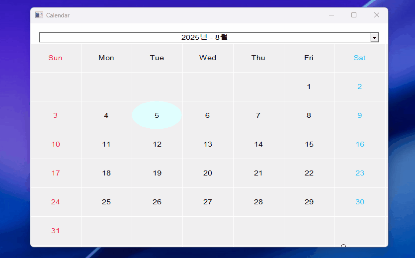

# 📌 Calendar 
Windows Legacy API를 이용한 달력 프로그램입니다. 
팝업 윈도우라는 이름의 커스텀 윈도우 클래스를 오브젝트화 하였습니다. 
이 프로젝트는 MIT 라이선스 하에 제공되어 누구나 자유롭게 사용, 수정, 배포할 수 있습니다. 개인 또는 상업적 용도로도 활용이 가능합니다. 
  
## 📝 Description 
본래 커스텀 윈도우 클래스를 제작한 후에는 컨트롤화 하거나 오브젝트화 하여 dll로 배포하는게 일반적이지만, 
기능이 많지 않기 때문에 단순히 목적 파일로 만들어 실행 가능한 달력 프로그램을 만들었습니다. 
필요에 따라 기능을 확장하고, dll로 추출하여 혼합 프로그래밍에 사용하실 수 있습니다. 
  
## 🚀 Getting Started 
### 🔧 Dependencies 
Windows 10 이상 
 
### 📥 Installing 
[Releases](https://github.com/stdFrog/Calendar/releases) 페이지에서 최신 버전을 확인하실 수 있습니다. 
압축 해제 후 `Calendar.exe` 또는 `CalendarInstaller.exe`를 실행합니다. 
설치 파일(CalendarInstaller.exe)을 다운로드한 경우 안내에 따라 안전하게 실행 파일(Calendar.exe)을 설치하시면 됩니다. 
 
### ▶️ Executing program 
- Calendar.exe 
  
## ❓ Help 
- 위 프로그램은 최대 [-5, +5] 범위의 연도까지만 지원합니다.
  
## 👤 Authors 
- stdsic — @https://github.com/stdsic/Calendar 
  
## 📚 Version History 
- 1.0.0 
  - 최초 릴리스 
  
## 🧾 License 
이 프로젝트는 [MIT License](LICENSE)로 라이선스되어 있습니다. 
자세한 정보는 LICENSE 파일을 참고하시기 바랍니다. 
 
